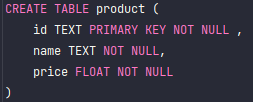
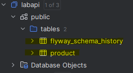

# Spring Boot - Basic API

Elaboração de uma API Restful utilizando o framework Spring Boot.

## Tecnologias utilizadas
Linguagens, Frameworks e Bibliotecas utilizadas na construção do projeto.

<!-- Link para badges https://devicon.dev/ -->

  
  
  
  
  
  
  
  
  
  

## Onde Aplicar
Este projeto pode ser aplicado em diversas situações:
- Desenvolvimento de APIs RESTful em projetos Spring Boot.
- Utilização de Docker para facilitar a criação de contêineres e isolamento de serviços.
- Gerenciamento de banco de dados PostgreSQL com o uso do Flyway para migrações de banco de dados.
- Configuração de ambientes de desenvolvimento com Java, Maven e outras tecnologias.

# Sumário

* [Instalações](#instalações)
  * [Pré-Requisitos](#pré-requisitos)
  * [Configuração de Ambiente](#configuração-de-ambiente)
* [Roadmap](#roadmap)
  * [Step 1](#step-1---inicialização-do-projeto-com-spring-initializr)
  * [Step 2](#step-2---configuração-do-projeto-e-migrações-com-flyway)
  * [Step 3](#step-3)
  * [Step 4](#step-4)
* [Contato](#contato)
* [License](#license)

## Instalações

Siga com precisão as orientações de configuração do ambiente para assegurar eficácia consistente no desenvolvimento do projeto.
 
### Pré-Requisitos
- **[Java](https://www.oracle.com/br/java/technologies/downloads/#jdk21-windows)** - você deve ter o Java JDK instalado em sua máquina.
- **[Maven](https://maven.apache.org/)** - certifique-se de ter o Maven instalado para gerenciar as dependências.
- **[Docker Desktop](https://www.docker.com/products/docker-desktop/)** - necessário para criar contêineres e executar serviços isolados.
- **[DataGrip](https://www.jetbrains.com/datagrip/download/#section=windows)** - ferramenta para o gerenciamento do banco de dados.
- **[Git](https://git-scm.com/downloads)** - ferramenta para o controle de versão.
- **[GitHub Desktop](https://desktop.github.com/)**  - ferramenta de auxílio no controle de versão.

### Recursos adicionais
- **[Spring Initializr](https://start.spring.io/)** - ferramenta online que para gerar uma estrutura básica de projetos Spring Boot com as dependências necessárias.

## Roadmap
 ### STEP 1 - Inicialização do Projeto com Spring Initializr
1. **Acesse o [Spring Initializr](https://start.spring.io/)**.

2. **Configure as Opções do Projeto**
   - **Project:** selecione "Maven".
   - **Language:** escolha "Java".
   - **Spring Boot:** Selecione 3.2.0.
   - **Project Metadata:** Preencha com o `Group`, `Artifact`, `Name`, e `Description` que você deseja.
   - **Packaging:** Escolha "Jar".
   - **Java:** Selecione a versão 17.

3. **Adicione Dependências:**
  - No campo de pesquisa de dependências, adicione as dependências a seguir para a criação de uma API REST Spring Boot:
    - Spring Web
    - Flyway Migration
    - PostgreSQL Driver
    - Spring Data JPA
    - Lombok
    - Validation

4. **Faça o Download do Projeto:** 
Clique no botão "Generate" para baixar um arquivo ZIP contendo a estrutura inicial do projeto.

5. **Extraia o Arquivo ZIP em um diretório de sua escolha.**

6. **Importe o Projeto na sua IDE (como o IntelliJ IDEA, VSCode, Eclipse).**

7. **Verifique se as dependências foram instaladas corretamente no arquivo pom.xml.**

### STEP 2 - Configuração do Projeto e Migrações com Flyway
1. **Abra o Projeto na sua IDE**

2. **Configuração do Banco de Dados PostgreSQL**
  - Certifique-se de que o PostgreSQL esteja instalado e configurado.
  - Crie um banco de dados no PostgreSQL para ser utilizado pela sua aplicação.
  - Atualize as informações do banco de dados no arquivo `application.properties` dentro do diretório `src/main/resources`.

3. **Configuração do Flyway**
  - Crie um diretório chamado `db/migration` dentro do diretório `src/main/resources`.

  - Nele adicionaremos os scripts SQL de migração, seguindo o padrão de nomenclatura do Flyway.

  - Crie o file com o nome `V1__create-table-product.sql`
    - O padrão sempre será: `V` de versão `1` [número da versão] `__` underline duplo `create` [comando que você quer realizar] `table` na tabela `product` [nome tabela]

  - Insira o comando SQL a seguir:

4. **Execução das Migrações:**

  - Inicie a aplicação Spring Boot acionando o botão "Run" da sua aplicação.

  - Durante o processo de inicialização, o Flyway irá automaticamente detectar e executar os scripts de migração localizados na pasta `db/migration` do diretório `src/main/resources`.

  - Esses scripts contêm instruções SQL para criar ou modificar a estrutura do banco de dados conforme necessário.

  - O Flyway mantém um controle interno das migrações já aplicadas, garantindo que apenas novas migrações sejam executadas e permitindo uma visão clara das versões do banco de dados ao longo do tempo.

5. **Verificação das Migrações:**
  - Verifique no gerenciador do banco de dados (como DBeaver, DataGrip) se as migrações foram aplicadas corretamente.

 

  - Em seu gerenciador do banco de dados deve aparecer duas tabelas:
    - `flyway_schema_history` - tabela de controle de versionamento do banco de dados.
    - `sua_tabela_aqui` - tabela que você criou inicialmente no PostgreSQL e configurou o caminho na migrations.

## Contato
Kimberly Spencer Lourenço - [kimberlylizsl@gmail.com](mailto:kimberlylizsl@gmail.com).

GitHub: [github.com/kspencerl](https://github.com/kspencerl)

## License

Este projeto é licenciado sob a [Nome da Licença](URL da Licença) - veja o arquivo [LICENSE.md](LICENSE.md) para mais detalhes.

